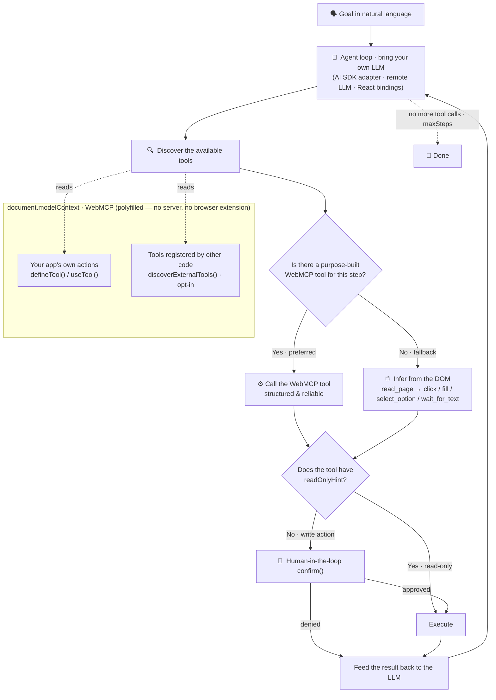

<p align="center">
  
</p>

<h1 align="center">gui-agent</h1>

<p align="center">
  <strong>An open-source, WebMCP-powered GUI agent that lives inside your web app.</strong><br/>
  Let a natural-language agent operate your UI — click, fill, navigate, call your app's own actions — driven by any LLM you bring.
</p>

<p align="center">
  <a href="https://www.npmjs.com/package/@aralroca/gui-agent"></a>
  <a href="https://www.npmjs.com/package/@aralroca/gui-agent"></a>
  <a href="https://webmachinelearning.github.io/webmcp/"></a>
  
  <a href="./LICENSE"></a>
</p>

<p align="center">
  
</p>

<p align="center"><sub>The optional <a href="#-visualizing-the-agent-aralrocagui-agentui">visualizer</a> in action: status chips per tool call, an animated gradient glow that tours every element the agent touches, and a backdrop veil that keeps the user's focus on the action.</sub></p>

---

Inspired by [page-agent](https://github.com/alibaba/page-agent), but built on the emerging [**WebMCP**](https://webmachinelearning.github.io/webmcp/) standard via a polyfill.

- 📦 **Just an npm package.** `npm i @aralroca/gui-agent` and `import`. No script injection, no browser extension, no headless browser.
- 🧩 **Standards-based.** Tools are registered on `document.modelContext` (WebMCP). The polyfill (`@mcp-b/webmcp-polyfill`) installs it where browsers don't natively support it yet.
- 🎯 **Producer + consumer in one.** Expose your app's actions as precise tools *and* fall back to text-based DOM driving for everything else.
- 🧠 **Bring your own LLM.** A tiny provider-agnostic interface, plus a ready-made Vercel AI SDK adapter.
- 🪶 **Headless core.** No UI imposed — wire it to your own chat, command bar, or voice.
- ✨ **Opt-in visualizer.** Status chips per action, an animated gradient glow around the element being acted on, and a backdrop blur that spotlights it (`@aralroca/gui-agent/ui`).

> ⚠️ Early/experimental. WebMCP is a moving [W3C draft](https://webmachinelearning.github.io/webmcp/); APIs may change.

## Table of Contents

- [Install](#install)
- [Quick start](#quick-start)
- [How it works](#how-it-works)
  - [How the agent picks a tool](#how-the-agent-picks-a-tool)
- [Compared to page-agent](#compared-to-page-agent)
- [API](#api)
  - [Core](#core-aralrocagui-agent)
  - [Visualizing the agent](#-visualizing-the-agent-aralrocagui-agentui)
  - [Bring your own LLM](#bring-your-own-llm)
  - [AI SDK adapter](#ai-sdk-adapter-aralrocagui-agentai-sdk)
  - [React](#react-aralrocagui-agentreact)
- [Safety](#safety)
- [Demo](#demo)
- [Develop](#develop)
- [License](#license)

## Install

```bash
npm i @aralroca/gui-agent
# optional peers, depending on what you use:
npm i ai zod        # for the AI SDK adapter / Zod schemas
```

## Quick start

```ts
import { defineTool, GuiAgent } from "@aralroca/gui-agent";
import { createAiSdkLlm } from "@aralroca/gui-agent/ai-sdk";

// 1. Expose your app's actions as tools (producer side, optional).
defineTool({
  name: "go_to_tab",
  description: "Switch the console to a tab.",
  inputSchema: { type: "object", properties: { tab: { type: "string" } }, required: ["tab"] },
  annotations: { readOnlyHint: true },
  execute: ({ tab }) => router.push(`/${tab}`),
});

// 2. Run the agent. It discovers your tools + synthesizes DOM tools (click/fill/read).
const agent = new GuiAgent({
  llm: createAiSdkLlm({ model: "anthropic/claude-opus-4-8" }),
  confirm: async (call) => window.confirm(`Allow "${call.name}"?`), // HITL gate
});

await agent.run("Invite jane@acme.com to the team as admin");
```

Importing the package installs the WebMCP polyfill automatically — **no `<script>` tag**.

## How it works

`gui-agent` unifies two approaches:

1. **Producer (WebMCP).** Your app calls `defineTool(...)` to register reliable, structured actions on `document.modelContext`. Any WebMCP agent — including a browser's native one — can use them.
2. **DOM fallback (page-agent style).** For anything not exposed, the agent builds a compact **text snapshot** of the page (roles, labels, values, stable refs like `e7`) and gets synthesized `read_page` / `click` / `fill` / `select_option` / `wait_for_text` tools. No screenshots, no multimodal model needed.

The built-in loop discovers all available tools, asks your LLM what to do, runs the calls (gated by your optional `confirm`), feeds results back, and repeats until done.

### How the agent picks a tool

For each step the agent prefers a **purpose-built WebMCP tool** if one fits, and only **infers the DOM** when nothing is exposed for the job:



> The agent is handed a **single merged tool list** and is instructed to prefer your app's WebMCP tools; the synthesized DOM tools are the always-on fallback (a same-named app tool wins). WebMCP tools live on `document.modelContext` — your app registers them (so any WebMCP agent, including the browser's native one, can call them) and `discoverExternalTools()` can pull in tools other code registered there. `upload_file` and `navigate` DOM tools are opt-in.

## Compared to page-agent

gui-agent is inspired by **[page-agent](https://github.com/alibaba/page-agent)** and shares its core idea — a natural-language agent that drives a real web page from a **text-based DOM** snapshot (no screenshots, no multimodal model) with a bring-your-own-LLM design. The difference is what gui-agent adds by building on the emerging **WebMCP** standard instead of DOM-driving alone:

| Capability | gui-agent | page-agent |
| --- | --- | --- |
| **WebMCP standard** (`document.modelContext`) | ✅ Built on the [W3C WebMCP draft](https://webmachinelearning.github.io/webmcp/) + polyfill | ❌ Not WebMCP — its "MCP" is a separate Node server that lets *external* agents drive the browser |
| **App actions as standard tools** | ✅ `defineTool` registers structured actions on `document.modelContext`, callable by *any* WebMCP agent — including the browser's native one | ⚠️ Custom tools are client-side config, marked `@experimental`, and not exposed via a page standard |
| **Interop with other in-page tools** | ✅ `discoverExternalTools()` picks up tools other code registered on `document.modelContext` | ❌ Not available |
| **Human-in-the-loop safety gate** | ✅ Built-in `confirm()` gate — every non-`readOnlyHint` tool is routed through approval before it runs | ⚠️ No mandatory approval gate and no read-only/write distinction (runs autonomously up to `maxSteps`); offers `ask_user`, lifecycle hooks and data-masking instead |
| **First-class React bindings** | ✅ `GuiAgentProvider`, `useGuiAgent`, `useTool`, `<AgentSteps />` | ❌ None (vanilla panel UI) |
| **Provider-agnostic LLM** | ✅ Any shape via a one-function `Llm` interface, plus a Vercel AI SDK adapter and a remote-LLM helper | ⚠️ Bring-your-own, but the endpoint must be **OpenAI-compatible** |
| **Producer + consumer in one** | ✅ Precise structured producer tools *and* a DOM fallback in a single loop | ➖ Primarily a DOM driver (custom tools experimental) |

**When page-agent is the better fit.** page-agent is excellent and has real strengths gui-agent doesn't: it drives **any existing site's DOM without the app opting in**, so it works on legacy or third-party apps (ERP, CRM, admin panels) you don't control — whereas gui-agent's producer tools need the app to register them (its DOM fallback still works anywhere, but the WebMCP value comes from instrumentation). page-agent also ships an optional **Chrome extension** for cross-tab tasks and a **Node MCP server** so external agents (Claude Desktop, Cursor) can drive a real browser. Both projects are MIT-licensed, TypeScript, text-based, and ship an activity visualizer.

In short: reach for **page-agent** to automate sites you *don't* own; reach for **gui-agent** when you *do* own the app and want standards-based, structured, human-gated tools — with a DOM fallback for everything else.

## API

### Core (`@aralroca/gui-agent`)

| Export | Purpose |
| --- | --- |
| `defineTool(def, opts?)` → `dispose` | Register a WebMCP tool. `def`: `{ name, description, inputSchema?, annotations?, execute }`. `inputSchema` accepts plain JSON Schema or a Zod schema. Unregister via the returned function or `opts.signal`. |
| `new GuiAgent(options)` / `agent.run(goal, signal?)` | The agent loop. Options: `{ llm, systemPrompt?, maxSteps?, domFallback?, confirm?, onStep?, domTools? }`. |
| `runAgent(goal, options)` | One-shot convenience. |
| `registry` / `ToolRegistry` | The tool registry (source of truth, mirrored to `document.modelContext`). |
| `discoverExternalTools()` | Read tools registered on `document.modelContext` by other code. |
| `ensureModelContext()` / `hasModelContext()` | Polyfill bootstrap helpers. |
| `DomSnapshotter` / `createDomTools()` | The DOM-fallback primitives, if you want them standalone. |

`GuiAgentOptions.domTools` forwards `DomToolsOptions` (`root`, `maxNodes`, `allowNavigation`, `onTarget`) to the per-run DOM tools. Just before each click/fill/select, the resolved live element is re-emitted on `onStep` as a `tool-target` step (carrying the originating `ToolCall`) — it's what powers the visualizer's glow.

### ✨ Visualizing the agent (`@aralroca/gui-agent/ui`)

Show users what the agent is doing while it does it: a status chip per tool call ("Clicking" with a spinner → ✓, ✗ on error, blocked when denied), a "Thinking…" indicator between turns, and an **animated gradient glow ring** around the DOM element being acted on — while the rest of the page **blurs behind a backdrop veil** so the target stands out. Zero dependencies, rendered in shadow DOM so styles never leak.

```ts
import { GuiAgent } from "@aralroca/gui-agent";
import { createAgentVisualizer } from "@aralroca/gui-agent/ui";

const viz = createAgentVisualizer({
  container: document.querySelector("#agent-steps")!, // where the chips go
});

// `bind` composes the visualizer into your agent options (it never replaces
// your own `onStep` — it chains it).
const agent = new GuiAgent(viz.bind({ llm }));
await agent.run("Invite jane@acme.com as admin");
```

Everything is configurable:

```ts
createAgentVisualizer({
  chips: true,               // action chip list
  highlight: true,           // glow ring on the target element
  showThinking: true,        // "Thinking…" indicator between LLM turns
  locateButton: true,        // ◎ button on chips to re-flash the target
  glowDuration: 1200,        // ms the ring holds on the last target before fading
  glowDwell: 500,            // min ms per target when several highlights queue up
  backdrop: {                // blur/dim the page around the target (or false)
    blur: 3,                 // px
    exclude: ["chat-panel"], // element ids (or Elements) to keep sharp
  },
  labels: {                  // per-tool chip labels (string or fn)
    click: "Clicking",
    invite_member: (call) => `Inviting ${call.arguments.email}`,
  },
  theme: {                   // maps to --gua-* CSS custom properties
    accent: "#2563eb",
    chipBg: "#f4f4f5",
    chipBorder: "#e4e4e7",
    chipText: "#3f3f46",
    font: "system-ui, sans-serif",
    glowColors: ["#7c8cf8", "#f0a6c8", "#7ee0c3"],
  },
});
```

The glow follows automatically for the DOM-fallback tools (`click`, `fill`, `select_option`). Producer tools act through your own code, so they opt in by calling `viz.highlight(element)` from their `execute` — call it once per element you touch and the ring tours them in order (agent actions run faster than human perception, so highlights are queued with a minimum dwell per target).

Known limitation: elements in the top layer (`<dialog showModal>`, fullscreen) paint above the overlay.

### Bring your own LLM

Implement the `Llm` interface — one async function, one turn:

```ts
import type { Llm } from "@aralroca/gui-agent";

const llm: Llm = async ({ messages, tools, signal }) => {
  // call your model with `messages` + `tools`; return one turn
  return { text: "...", toolCalls: [{ id, name, arguments }] };
};
```

### AI SDK adapter (`@aralroca/gui-agent/ai-sdk`)

```ts
import { createAiSdkLlm, createRemoteLlm } from "@aralroca/gui-agent/ai-sdk";

// Run the model in-process (client key, demo, or server agent):
const llm = createAiSdkLlm({ model: "anthropic/claude-opus-4-8" });

// …or keep the model server-side and execute tools in the browser:
const llm = createRemoteLlm({ api: "/api/chat" });
// endpoint receives { messages, tools } and returns { text?, toolCalls? }
```

### React (`@aralroca/gui-agent/react`)

```tsx
import { useTool, GuiAgentProvider, useGuiAgent, AgentSteps } from "@aralroca/gui-agent/react";

function UsersPage() {
  // Registered while mounted; auto-unregistered (AbortSignal) on unmount.
  useTool({
    name: "search_users",
    description: "Search users by name or id",
    inputSchema: { type: "object", properties: { query: { type: "string" } }, required: ["query"] },
    annotations: { readOnlyHint: true },
    execute: ({ query }) => store.search(query),
  });
  return /* … */;
}

function Chat() {
  const { run, running, steps, visualizer } = useGuiAgent();
  // wire to your own chat UI; <AgentSteps /> renders the visualizer's chips
}

// Enable the visualizer on the provider (true, or AgentVisualizerOptions):
<GuiAgentProvider llm={llm} visualizer>
  <Chat />
  <AgentSteps />
</GuiAgentProvider>
```

## Safety

WebMCP tools run with the user's existing session/cookies, so a tool can do real, privileged things. `gui-agent` gives you a **`confirm` gate**: any tool *without* `annotations.readOnlyHint` is routed through your `confirm(call, tool)` callback before it runs — the natural place to plug in a human-in-the-loop approval UI. Mark genuinely read-only tools with `readOnlyHint: true` so they don't prompt. See the WebMCP spec's [security considerations](https://webmachinelearning.github.io/webmcp/#security-privacy).

## Demo

```bash
npm run demo   # opens a mini "console" you can drive in natural language
```

Try: *"invite jane@acme.com as admin"*, *"search Kenji"*, or *"change my display name to Neo"* (the last one uses the DOM fallback — nothing is exposed for it). The demo ships with the visualizer enabled by default, so you'll see the chips, the glow tour, and the backdrop veil exactly as in the GIF above.

## Develop

```bash
npm install
npm test          # vitest + jsdom
npm run build     # tsup → ESM + .d.ts for all entry points
npm run typecheck
```

## License

[MIT](./LICENSE) © Aral Roca
